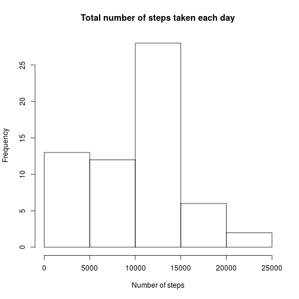
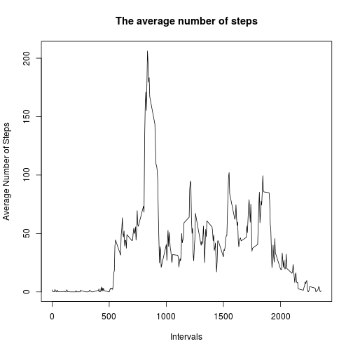
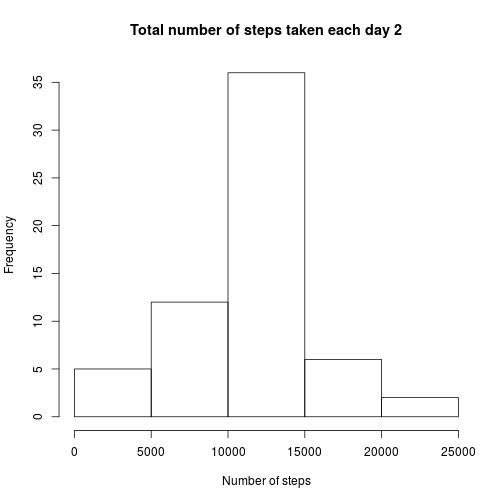
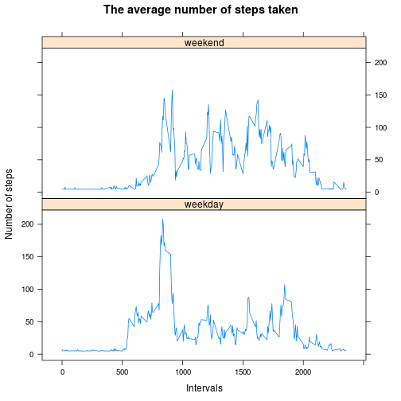

#"Reproducible Research: Peer Assessment 1"

## Loading and preprocessing the data
1. The function read.csv is used to load the data into a data frame.

```r
DF <- read.csv("/home/bahar/COURSERA/ReproducibleResearch/RepData_PeerAssessment1/activity.csv" , sep =',' , header = TRUE)
```


## What is mean total number of steps taken per day?
1. Calculate the total number of steps taken per day.

```r
Sstep <-vector()
for (i in unique(DF$date))
{
  Sstep <- append(Sstep , sum(DF$steps[DF$date == i] , na.rm = TRUE) ) 
}
sum(Sstep)
```

```
## [1] 570608
```

```r
head(Sstep)
```

```
## [1]     0   126 11352 12116 13294 15420
```

2. Make a histogram of the total number of steps taken each day.

```r
hist(Sstep , main = "Total number of steps taken each day" , xlab = "Number of steps")
```

 

3.Calculate and report the mean and median of the total number of steps taken per day.


```r
mean(Sstep)
```

```
## [1] 9354.23
```

```r
median(Sstep)
```

```
## [1] 10395
```

## What is the average daily activity pattern?
1. Make a time series plot (i.e. type = "l") of the 5-minute interval (x-axis) and the average number of steps taken, averaged across all days (y-axis)

```r
Intervals <- unique(DF$interval)
Mstep <- vector()
for (j in Intervals)
{
  Mstep <- append(Mstep,mean(DF$steps[DF$interval==j] , na.rm = TRUE))
}
plot(Intervals, Mstep, type = "l" , xlab = "Intervals" , ylab = "Average Number of Steps", 
     main = "The average number of steps")
```

 

2.Which 5-minute interval, on average across all the days in the dataset, contains the maximum number of steps?


```r
MaxID <-vector()
for( ii in 1:length(unique(DF$interval)) )
{
  if (Mstep[ii] == max(Mstep))
  {
    MaxId <- Intervals[ii]
  }
}
MaxId
```

```
## [1] 835
```
Therefore, the 835th time interval contains the maximumm number of steps, in average.

## Imputing missing values
1. Calculate and report the total number of missing values in the dataset.


```r
sum(!is.na(DF$steps))
```

```
## [1] 15264
```

2.Devise a strategy for filling in all of the missing values in the dataset. The strategy does not need to be sophisticated. For example, you could use the mean/median for that day, or the mean for that 5-minute interval, etc.

For this part, missing values are replaced with the mean of number of steps over the 5-min intervals.


```r
DF1 <- replace(DF$steps , is.na(DF$steps) , mean(Mstep))
```

3.Create a new dataset that is equal to the original dataset but with the missing data filled in.

```r
NewDF <- data.frame(DF1 , DF$date , DF$interval)
colnames(NewDF)<- c("steps", "date", "interval")
head(NewDF)
```

```
##     steps       date interval
## 1 37.3826 2012-10-01        0
## 2 37.3826 2012-10-01        5
## 3 37.3826 2012-10-01       10
## 4 37.3826 2012-10-01       15
## 5 37.3826 2012-10-01       20
## 6 37.3826 2012-10-01       25
```

4.Make a histogram of the total number of steps taken each day and Calculate and report the mean and median total number of steps taken per day. Do these values differ from the estimates from the first part of the assignment? What is the impact of imputing missing data on the estimates of the total daily number of steps?


```r
NSstep <-vector()
for (i in unique(DF$date))
{
  NSstep <- append(NSstep , sum(NewDF$steps[NewDF$date == i]) ) 
}
sum(NSstep)
```

```
## [1] 656737.5
```

```r
hist(NSstep , main = "Total number of steps taken each day 2" , xlab = "Number of steps")
```

 

The mean and median total number of steps per day are as follows:

```r
mean(NSstep)
```

```
## [1] 10766.19
```

```r
median(NSstep)
```

```
## [1] 10766.19
```

Here the missing values, that have been treated as zero before, are replaced with the average number of steps over intervals. Therefore, the total number of steps taken each day has increased. As a result, the mean has increased as well. Also, it causes a change in the median too.

## Are there differences in activity patterns between weekdays and weekends?
1.Create a new factor variable in the dataset with two levels – “weekday” and “weekend” indicating whether a given date is a weekday or weekend day.


```r
WeekDay <- as.Date(NewDF$date)
WeekDay <- weekdays(WeekDay)
for(jj in 1:length(WeekDay))
{
  if (WeekDay[jj] =="Saturday" | WeekDay[jj] == "Sunday")
  {
    WeekDay[jj] <- "weekend"
  }
  else
  {
    WeekDay[jj] <- "weekday"
  }
}
NewDF$WeekDay <- factor(WeekDay)
levels(NewDF$WeekDay) <- c("weekday" , "weekend")
head(NewDF)
```

```
##     steps       date interval WeekDay
## 1 37.3826 2012-10-01        0 weekday
## 2 37.3826 2012-10-01        5 weekday
## 3 37.3826 2012-10-01       10 weekday
## 4 37.3826 2012-10-01       15 weekday
## 5 37.3826 2012-10-01       20 weekday
## 6 37.3826 2012-10-01       25 weekday
```

```r
sum (NewDF$WeekDay == "weekend") + sum(NewDF$WeekDay == "weekday")
```

```
## [1] 17568
```

2.Make a panel plot containing a time series plot (i.e. type = "l") of the 5-minute interval (x-axis) and the average number of steps taken, averaged across all weekday days or weekend days (y-axis). 
For this part, first calculate teh average number of steps across all intervals.

```r
AveStep <- vector()
AveInt <- vector()
AveWeek <- vector()
for(i in unique(NewDF$interval))
{
  for(t in levels(NewDF$WeekDay))
  {
    AveStep <- append(AveStep , mean(NewDF$steps[NewDF$interval == i & NewDF$WeekDay== t]))
    AveInt <- append( AveInt , i)
    AveWeek <- append(AveWeek , t)
  }
}
```

Then make the plot using Lattic:


```r
library(lattice) 
xyplot(AveStep ~ AveInt | AveWeek, main="The average number of steps taken"  , 
       xlab = "Intervals" , ylab = "Number of steps"  , type='l' , layout = c(1,2))
```

 
